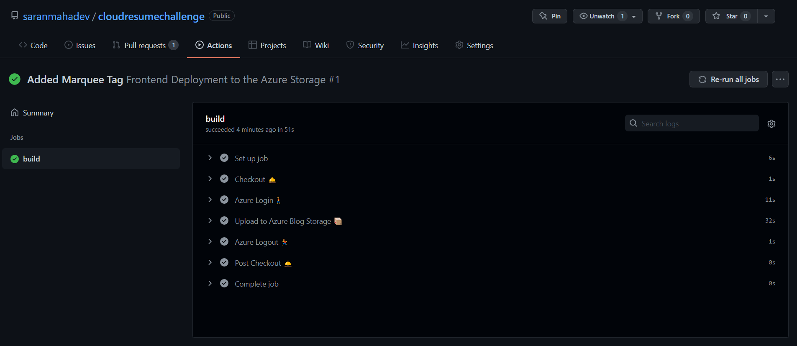
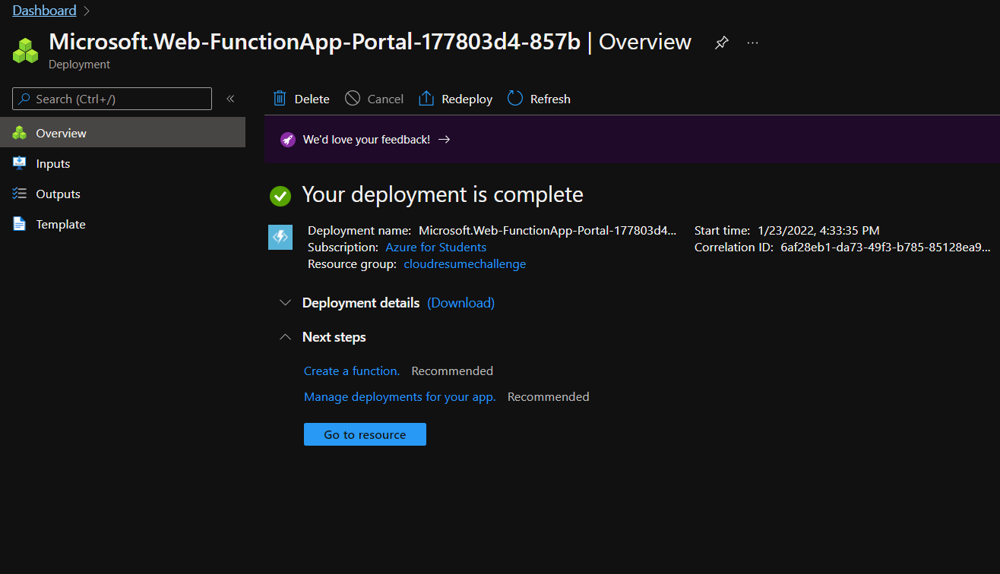
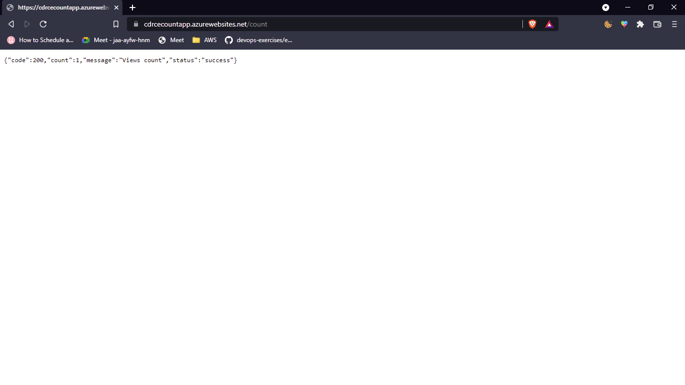

# Cloud Resume Challenge

The Cloud Resume Challenge is a hands-on project designed to help you bridge the gap from cloud certification to cloud job. It incorporates many of the skills that real cloud and DevOps engineers use in their daily work.

#### Why doing this?

This project is proposed by [Forrest Brazeal](https://forrestbrazeal.com/) who has lot of experience in cloud and DevOps and it is a great opportunity to learn and practice the skills that you need to be a cloud/devops engineer.

#### Challenge - [🔗](https://cloudresumechallenge.dev/docs/the-challenge/azure/)

### Solution

- Created My GitHub Repository - https://github.com/saranmahadev/cloudresumechallenge
- [Docsify](https://docsify.js.org/getting-started/) is used to generate the docs for my solution 
- For CI/CD created Three Branches
    - Frontend 
    - Backend
    - Docs
- Created my static site using HTML and CSS
- Deployed my static site to Azure Storage using the [Azure CLI](https://docs.microsoft.com/en-us/azure/storage/blobs/storage-blob-static-website-how-to)

- Integration with Azure CDN and mapping Subdomain ended in vain because of the limitations of Azure Student Account.

> Took a lot of time in the Azure Portal but later I got the idea to use Azure CLI to configure CDN.

- **GitHub Actions**(CI/CD) was created for the Frontend Branch and Whenever a push is made to the Frontend Branch, the Frontend Branch is deployed to ** Azure Storage**.

- Created a **Function App** in Azure to count the visitors to the site.

- Created a **Cosmos DB** to store the count of the visitors. 

- Decided to create a **Function App** to store the count of the visitors.

> Ended in vain due to some temporary issues in my local machine development.
> Issue - https://github.com/Azure/azure-functions-core-tools/issues/2364
> Tried all the solutions given but after a lot of time I could not get it to work.

- In replacement of the **Function App**, I created a **Web App** to store the count of the visitors.

- Configured Backend CI/CD using GitHub Actions and it was deployed to Azure.

> Need to improve this repo with more features like 
> - Adding Azure CDN
> - Mapping my Subdomain
> - Use Azure Functions instead of Azure Web App
> - Use ARM Template to deploy the Function App

